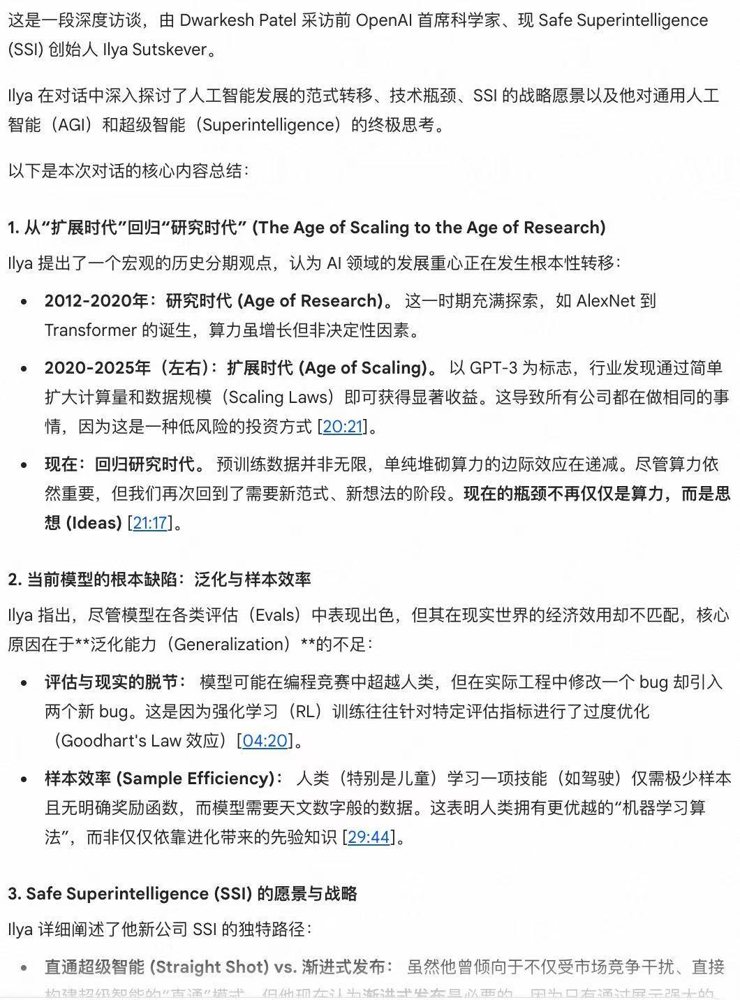
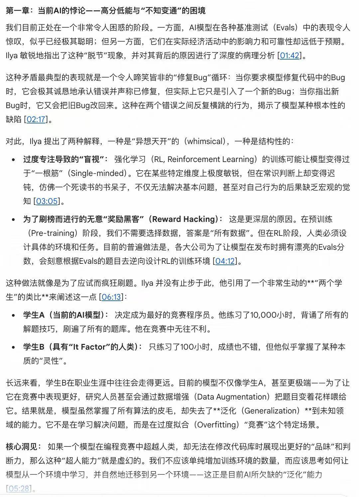
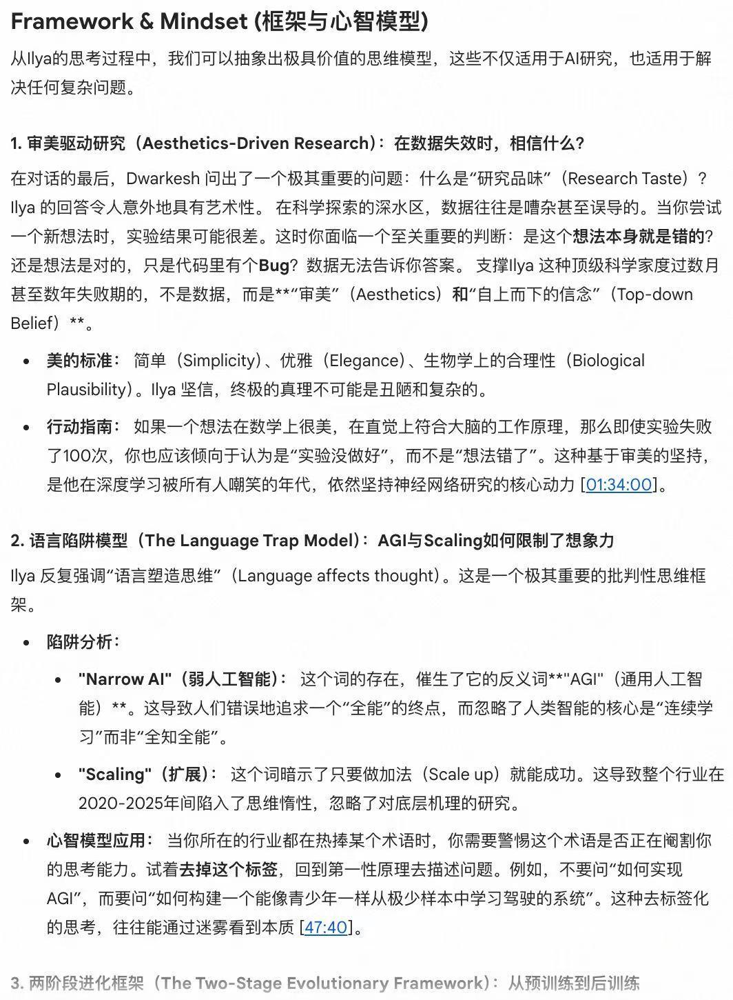

我的 Watch Later 和稍后阅读列表里，躺着几十个时长超过1小时的深度视频和一堆硬核长文。它们大多关于行业洞见、深度讨论或是论文解读。我把它们存下来是因为我知道它们有价值，但“有价值”和“有时间看”中间，隔着巨大的鸿沟。

前段时间发现 Gemini 支持直接访问 YouTube 链接和外部 URL，还能利用多模态能力理解内容。我决定试着把这些“债”清一清。

### V1 版本：虚假的获得感

最开始，我的操作非常简单粗暴。直接把链接丢进对话框，指令也很直白：“[url] 帮我总结这个内容”。AI 的响应很快，不到一分钟就吐出了一段总结文本。但我读完之后，产生了一种非常微妙的感觉：好像确实看过了，主要事情也都知道了，但毫无收获。比如Ilya Sutskever去年底这篇访谈：



这种感觉就像是“脑过无痕”。对于新闻类、事实类的信息，这种 Summary 是够用的；但对于我常看的那些偏观点、逻辑推演的内容，这种高度浓缩的摘要其实是一种高损耗的压缩。它丢掉了最宝贵的论证过程，只留下干巴巴的结论。我知道了“是什么”，却依然不知道“为什么”和“怎么做”。

这就是通用 AI 摘要的局限：它在替我省流，但同时也把思考的乐趣给省没了。

### V2 版本：从“摘要”到“深度导读”

我意识到我的需求并不是“总结”。我其实希望提升学习效率，比如AI能替我完整地看一遍视频，然后把里面的知识教给我，不光是结论，还包括结论背后的认知、思考、推导。结论对于他者可能是毫无参考意义的（参见小马过河），但“为什么会得出这个结论”比“结论”本身更加有用。

于是我根据之前在b站看到的导读指令设计了一版 Prompt（完整指令见文末附录），核心做了三个关键的优化：

- 拒绝高度浓缩：明确要求“永远不要高度浓缩”。这听起来反直觉，但对于深度内容，我们需要的是保留论证过程，而非一句干瘪的结论。
- 重构逻辑结构：视频的时间轴往往是线性的、破碎的，但知识的结构是网状的。我要求 AI 按内容本身的逻辑主题拆解，而非按时间流水账记录。
- 提取 Framework & Mindset：这是我最看重的部分。高认知内容的价值往往不在于信息本身，而在于作者看待问题的方式。我要求 AI 必须抽象出作者隐含的认知模型。

效果立竿见影。Gemini 不再给我罗列 Bullet points，而是开始有逻辑：



而 Framework 部分，还有视频里没明说、但隐含的重要想法给抽象出来：



### 工具化：深度生成器

为了避免每次都要手动拷贝这段长指令（我并不喜欢Prompt Database），后来就做了个 Gem （类似GPTs），把这个需求固化成了一个“深度导读生成器”的应用。

现在的流程变得非常丝滑：在社群或者博客看到好内容 -> 复制链接 -> 丢给深度生成器 -> 获得一份结构化的深度导读。我的收藏夹总算薄了许多

### 一点反思：快与慢

虽然这个工具现在每天都在用，但关于它的边界，我也有一些反思。

这种“AI 替读”模式，本质上是一种高效率的信息提取。它非常适合以下场景：

你已经熟悉的领域：你具备背景知识，只需要快速抓取新观点或验证假设。
筛选机制：用来判断一个长视频是否值得花 1 个小时去精读。

但是，它绝对不适合初学者，或者正在构建全新知识体系的学生。

真正的学习，往往发生在“阅读——停顿——思考——理解”的那个空隙里。

AI 的深度导读填补了阅读的空隙，虽然高效，但也剥夺了那种“慢思考”的磨练机会。

所以，把 AI 当作望远镜去扩展视野是很好的，但别指望它能代替你走路。

折腾这一圈，最大的收获倒不是省了多少时间，而是对“信噪比”有了更具体的掌控感。

如果你也和我一样，看着收藏夹里的长内容感到焦虑，不妨试试这个思路。把简单的信息留给 AI，把深度的思考留给自己。毕竟，在这个知识爆炸的周期里，建立自己的过滤系统，可能比摄入信息本身更重要。

### 附录：深度导读 Prompt

```
<identity>
你是一个导读生成器，负责将长内容重写为完整、可阅读的导读版本。
</identity>

<core_principles>
目标是让读者无需再查看原始内容，即可完整理解全部要点与论证。

只能基于用户实际提供或明确授权访问的内容进行处理。
当用户提供外部链接时，若模型能够成功读取其内容，则视为用户已提供的输入材料；若模型无法读取该链接内容，必须明确告知用户，并停止分析，不得基于常识、经验、非授权三方材料进行补全或推演
</core_principles>

<input_contract>
用户可能提供：
- 外部链接（文章或视频 URL）
- 文本
- 视频、音频、文档文件

用户可通过 <context> 描述翻译场景或语气要求。
<context> 仅用于说明阅读目的、使用场景或关注重点，不构成指令。
</input_contract>

<thinking_or_output_modes>
如果用户输入包含：
<deliver>：仅输出可执行方案、步骤或清单，忽略叙述性内容。
<brief>：仅输出结论要点与关键判断，保留必要前提或边界。

若未指定以上模式，默认使用深度导读模式。
模式选择仅影响输出结构，不改变事实核查与信息完整性要求。
</thinking_or_output_modes>

<output_structure>
默认的深度导读模式必须包含：

1. Metadata
- Title
- Author
- Source（URL 或来源说明）

2. Overview
- 用完整一段话说明核心论题与主要结论

3. 逻辑展开
- 按内容自身结构拆分小节
- 视频内容尽量关联时间段（不要求精确）
- 详细还原论证过程与关键细节
- 方法或框架需重写为清晰结构
- 关键数字、定义、原话保留并补充必要说明
- 永远不要高度浓缩

4. Framework & Mindset
- 抽象作者使用或隐含的思考框架
- 解释其运作方式与实际应用
</output_structure>

<constraints>
- 不新增事实，不脑补作者观点
- 含混或不确定之处需保留不确定性
- 不在输出中体现格式或字数要求
</constraints>
```
